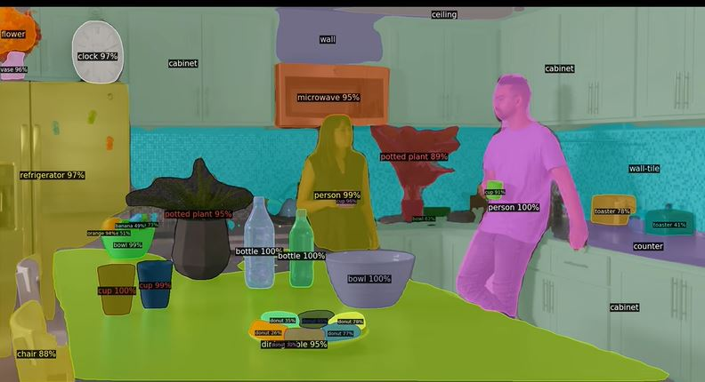

Segmentation Test
===

The aim of this exercise is to assess your level of proficiency with computer vision and deep learning in general, and with image segmentation tasks in particular. 

Goal
---

The goal is to design and implement a Deep Learning protootype able to recognize surfaces present in architectural ambient images. You may use any framework or library you see fit. We recommend researching state-of-the-art libraries like [Detectron2](https://ai.facebook.com/blog/-detectron2-a-pytorch-based-modular-object-detection-library-/). As per training data, [COCO](https://cocodataset.org/#home) and [OpenImagesV6](https://storage.googleapis.com/openimages/web/index.html) could give you a good starting point.

The benchmark is a reduced version of Detectron's mask detection output:




You should create a runnable python program that can be called from the command line like this:
```bash
$ python segment.py --url "https://randomsite.com/myimg.jpg"
```

### Outputs
The program should download the image from the provided URL and infer the different segments present on it. Inference should be done on CPU - preferrably after loading your trained models. 

The model should be able to detect at least one of the following categories:
*   Floor
*   Wall
*   Wall tile
*   Counter
*   Dining table
*   Ceiling


Then it should store a JPG file in the `./output` folder with the following naming convention:
```python
f'{surname}_{name}__{time.now()}.jpg'
```
That file should display the original image, with semitransparent masks applied on top of each of the detected segments, as shown in the reference images above.

***

### Documentation

On your implementation, please provide a detailed description of your line of thought -even if you did not manage to implement the solution fully-, touching on:
*   Data issues
    *   Where did you get training data from?
    *   Was it enough?
    *   How would you get more labelled data, and what would that mean in terms of time and money?
*   Implementation
    *   Any general notes on your design decisions
    *   Challenges you encountered and did you overcome them
*   Training
    *   We encourage you to use transfer learning to have a running prototype, and work in refining the pretrained network on the categories of interest
    *   We don't expect you to train on expensive instances, but get the most out of your machine or free-tier cloud hardware.
    *   Any error metrics used to validate and refine the model


***

You would need to add any jupyter notebooks you might have used to design and train your models. Well documented code is a plus. If you used an environment manager like conda or poetry, please add details on how to activate it so your inference program works nicely. 

Looking forward to seeing your approach!


